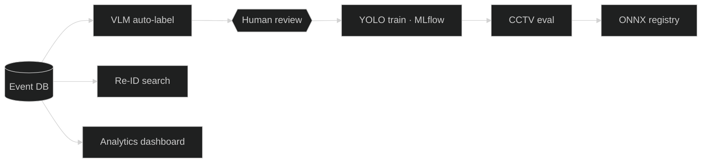

  <b>Yagiz Furkan Beyazit</b> — MLOps & Computer Vision Engineer 
  <a href="https://furkanbeyazit.github.io">portfolio</a> · <a href="https://www.linkedin.com/in/furkanbyagiz/">linkedin</a> · <a href="https://www.kaggle.com/veridisquoo">kaggle</a> · <a href="mailto:furkanb.yagiz@gmail.com">email</a>

The retraining loop I built and run alone at <b>Danusys</b> (2025.10 –), plus the services around it.

| | |
|---|---|
| **Now** | Danusys — CCTV analytics models (YOLO · Re-ID · VLM) and the MLOps pipeline: auto-labelling, review, training, evaluation, ONNX registry. Also: security analytics dashboard, video summary UI, VLM-Gate, daily report mailer. |
| **Before** | Petobio — LLM/RAG veterinary assistant · AI Educational Suite — GPT-4o quiz generation + RAG assistant · LeverLock — time-series anomaly detection · Genius Sports — match statistics |
| **Studied** | Ege University, Statistics BSc · Kyungbok University, Big Data · TOPIK 4 · TOEIC 940 |
| **Stack** | Python · PyTorch · YOLO · Qwen-VL · SAM · SOLIDER · Prefect · MLflow · ONNX · Docker · FastAPI · Gradio · LangChain · FAISS · PostgreSQL · MySQL · MongoDB · JavaScript · Alpine.js · ECharts · Power BI · Tableau |

Internal systems — no source here, architecture walk-throughs on request.

