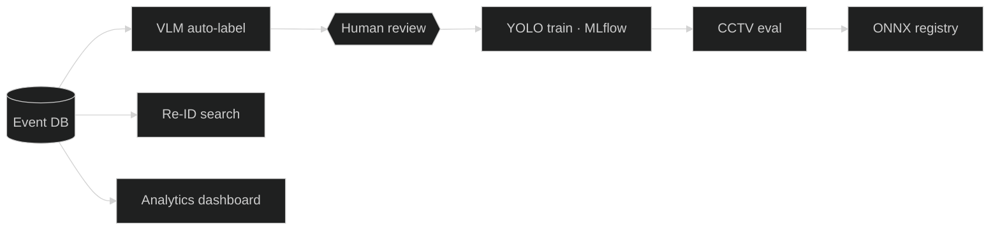

<!-- O header + mermaid + E 2x2 expertise + C featured cards -->

  <b>Yagiz Furkan Beyazit</b> — MLOps & Computer Vision Engineer 
  <a href="https://furkanbeyazit.github.io">portfolio</a> · <a href="https://www.linkedin.com/in/furkanbyagiz/">linkedin</a> · <a href="https://www.kaggle.com/veridisquoo">kaggle</a> · <a href="mailto:furkanb.yagiz@gmail.com">email</a>

The retraining loop I built and run alone at <b>Danusys</b> (2025.10 –), plus the services around it. Statistician turned AI engineer; before that LLM/RAG at Petobio, anomaly detection at LeverLock.

## What I work on

<table>
<tr>
<td valign="top" width="50%">

**Computer Vision**
- YOLO detection: training, fine-tuning, field evaluation
- Person Re-ID with SOLIDER embeddings, cross-camera search
- VLM (Qwen-VL) as a labeller and as an event reporter
- SAM-assisted bbox correction in review tools

</td>
<td valign="top" width="50%">

**MLOps**
- Prefect flows with human checkpoints (review, balance)
- MLflow experiment tracking, ONNX export, model registry
- FastAPI services + Gradio / Alpine.js internal tools
- Docker deployment, Windows field packaging

</td>
</tr>
<tr>
<td valign="top" width="50%">

**LLM**
- RAG over course / product documents (LangChain, FAISS)
- Structured generation (quiz creation from PDFs, GPT-4o)
- LLM ↔ VMS ↔ VLM bridging over SSE

</td>
<td valign="top" width="50%">

**Data & Analytics**
- PostgreSQL / MySQL / MongoDB, Pandas
- Time-series monitoring and anomaly detection
- Dashboards & reports: ECharts, Power BI, Tableau, Excel automation

</td>
</tr>
</table>

## Featured

<table>
  <tr>
    <td width="50%" valign="top">
      <h3>🔁 MLOps Retraining Platform</h3>
      
Event DB → two-stage VLM auto-label → human review → class balancing → YOLO training (MLflow) → CCTV eval → ONNX + model registry. One dashboard, two human checkpoints.

      YOLO · Qwen-VL · SAM · Prefect · MLflow · FastAPI · PostgreSQL
    </td>
    <td width="50%" valign="top">
      <h3>🧍 Person Re-ID Search</h3>
      
1024-d SOLIDER embedding for every person detection; cosine search answers "where else was this person seen?" across cameras and days.

      PyTorch · SOLIDER · FastAPI · PostgreSQL
    </td>
  </tr>
  <tr>
    <td width="50%" valign="top">
      <h3>📊 Model Eval Platform</h3>
      
Up to three YOLO checkpoints side by side on real field CCTV sets — mAP/P/R plus per-image TP/FP/FN — exported to a 12-sheet Excel report.

      Ultralytics · FastAPI · Gradio
    </td>
    <td width="50%" valign="top">
      <h3>🎥 Video Summary Platform</h3>
      
Web UI for a VLM video-analysis backend: event timeline with bbox overlay, object tracks, cross-camera person linking via Re-ID.

      ES Modules · HLS · ffmpeg
    </td>
  </tr>
</table>

Also: security analytics dashboard (FastAPI + ECharts), VLM-Gate SSE bridge (Docker), daily report mailer, and an earlier AI educational suite (GPT-4o quiz generation + RAG assistant). Internal work — architecture walk-throughs on request.

| | |
|---|---|
| **Studied** | Ege University, Statistics BSc · Kyungbok University, Big Data · TOPIK 4 · TOEIC 940 |
| **Stack** | Python · PyTorch · YOLO · Qwen-VL · SAM · SOLIDER · Prefect · MLflow · ONNX · Docker · FastAPI · Gradio · LangChain · FAISS · PostgreSQL · MySQL · MongoDB · JavaScript · Alpine.js · ECharts · Power BI · Tableau |

