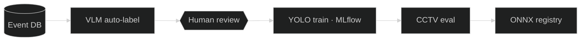

<!-- A minimal prose + B skills/experience console + O mini mermaid -->
### Furkan Beyazit

MLOps & computer vision engineer in Seoul. I build the unglamorous parts of vision systems — auto-labelling, retraining loops, evaluation, deployment — and ship them as tools people actually use.

**Now** · Researcher at Danusys: CCTV analytics models (YOLO, Person Re-ID, VLM) and the MLOps pipeline around them, built solo.
**Before** · LLM/RAG products at Petobio · time-series anomaly detection at LeverLock · sports statistics at Genius Sports.
**Background** · Statistics BSc (Ege University) · Big Data (Kyungbok University) · TOPIK 4, TOEIC 940.



**Recent work**

- MLOps retraining platform — the loop above, one dashboard, two human checkpoints
- Person Re-ID search — SOLIDER embeddings over every detection, cross-camera "where else was this person?" queries
- Model eval platform — three checkpoints side by side on real field footage, per-image TP/FP/FN, Excel export
- Security analytics dashboard, video summary UI, VLM-Gate bridge, daily report mailer
- Earlier: quiz generation from course PDFs (GPT-4o + LangChain) and a RAG school assistant

Company work, so no source here — architecture walk-throughs on request.

```console
furkan@seoul ~ $ cat skills.toml
vision  = ["YOLO", "PyTorch", "Person Re-ID", "Qwen-VL", "SAM"]
mlops   = ["Prefect", "MLflow", "ONNX", "Docker", "FastAPI", "Gradio"]
llm     = ["LangChain", "RAG", "FAISS", "OpenAI API"]
data    = ["PostgreSQL", "MySQL", "MongoDB", "Pandas", "time-series / anomaly detection"]
front   = ["JavaScript", "Alpine.js", "ECharts", "Tailwind"]

furkan@seoul ~ $ git log --oneline --experience
2025.10  Danusys        Researcher — MLOps & CV
2024.07  Petobio        AI Engineer Intern — LLM / RAG
2024.07  LeverLock      Researcher — time-series anomaly detection
2023.07  Genius Sports  Sports Statistician
```

[Portfolio](https://furkanbeyazit.github.io) · [LinkedIn](https://www.linkedin.com/in/furkanbyagiz/) · [Kaggle](https://www.kaggle.com/veridisquoo) · furkanb.yagiz@gmail.com
